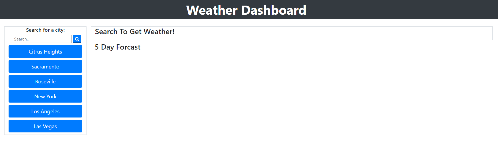
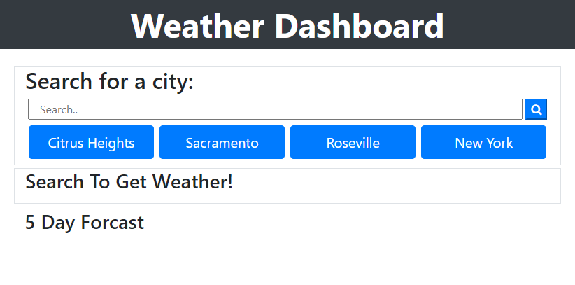
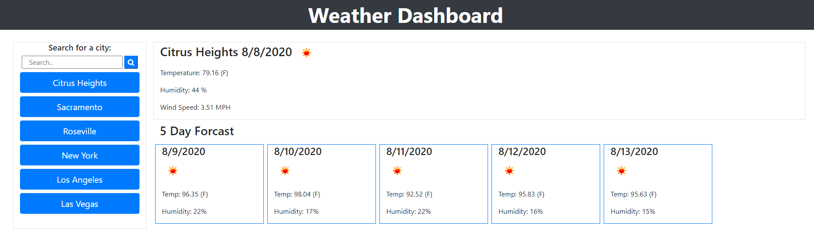
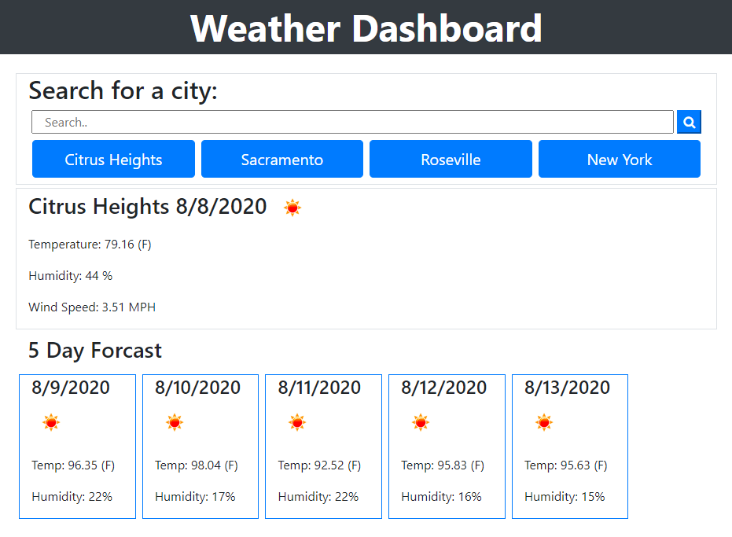

# weather-forcast
Handy web app to check the current weather by search.  This app also have a few pre programmed hotkeys for some areas i find interesting.  This was designed with a lot of care in how the layout was on all screen sizes.  This project pushed my understanding of bootstrap to new levels.

One feature i am proud of is the side controls change to a top display when the screen size gets small enough.

## Link to deployed site
https://jbaxter91.github.io/weather-forcast/

## Default Wide Screen

## Default Mobile Screen

## Search Wide Screen

## Search Mible Screen

